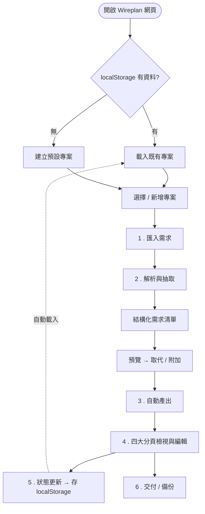
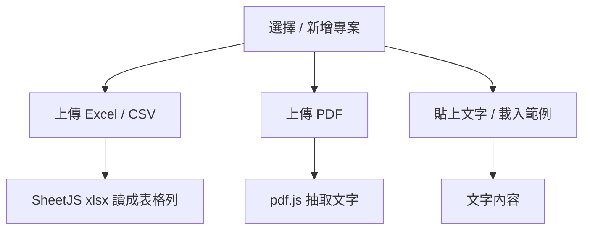
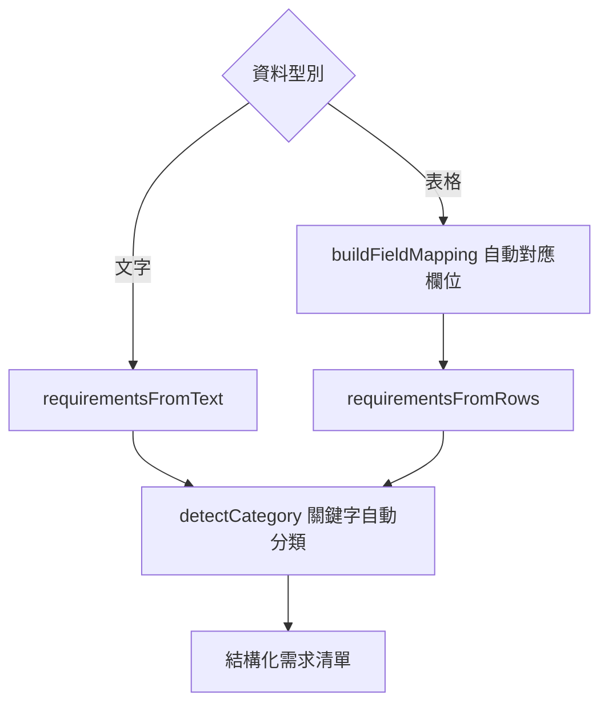
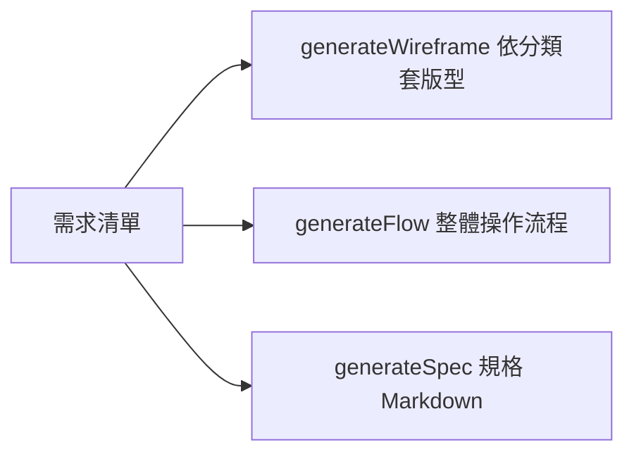
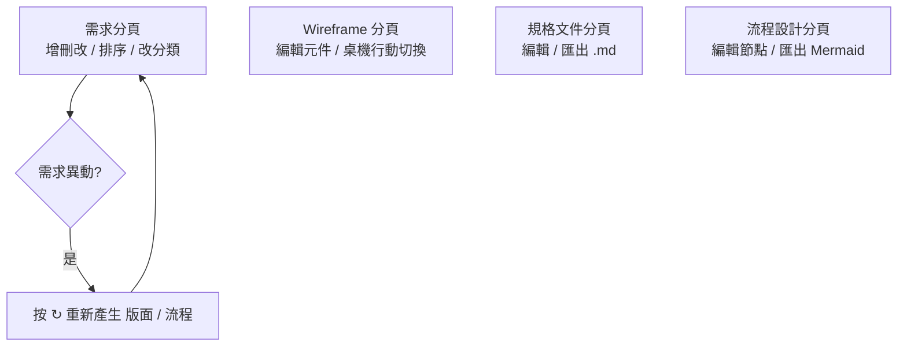
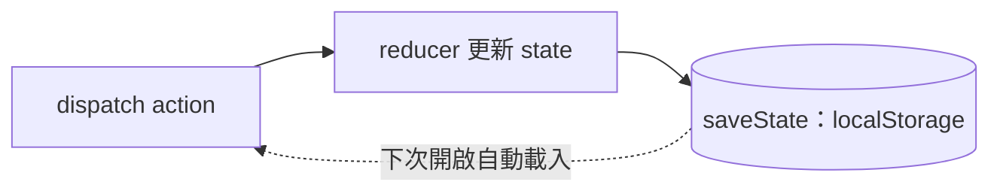
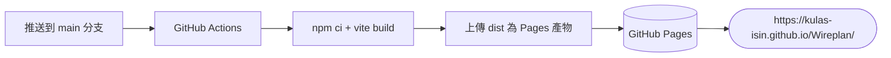

# Wireplan 系統運作流程

> 貼到 [HackMD](https://hackmd.io) 即可看到下方流程圖（HackMD 內建 Mermaid，向量渲染、放大清晰）。
> 若圖沒出現：HackMD 右上「⋯」→ 確認文件為 Markdown 模式即可。

---

## 一、總覽流程圖

---

## 二、各階段細節

### 1. 匯入需求（Import）

- Excel / CSV：用 **SheetJS** 讀成表格列（自動略過上方標題列，抓「欄位最多」的那列當表頭）。
- PDF：用 **pdf.js** 抽取文字（掃描圖檔型 PDF 無法抽字，需改貼文字）。
- 文字 / 範例：每行一項需求，可用「：」分隔名稱與說明。

### 2. 解析與抽取（src/lib）

- 自動對應「功能名稱 / 說明 / 工時 / 報價 / 分類…」欄位（可手動調整）。
- `detectCategory` 依關鍵字判斷分類：登入、列表、表單、儀表板、報表、流程、金流、設定…

### 3. 自動產出（Generate）

| 產出 | 說明 |
| --- | --- |
| Wireframe | 依需求分類自動套對應版型的可編輯線框 |
| 規格文件 | 概述、功能總表、逐項詳述、非功能需求、異動紀錄（Markdown） |
| 流程設計 | 整體操作流程，可匯出 Markdown 與 Mermaid |

### 4. 檢視與編輯（四大分頁）

### 5. 狀態與持久化

所有操作都經 reducer 更新狀態並即時寫入瀏覽器 `localStorage`（單機、各裝置資料不互通）。

### 6. 交付 / 備份

- 匯出 / 匯入「專案 JSON」（跨裝置搬移、交付客戶）。
- 規格文件匯出 `.md`、流程圖匯出 `.mmd`（Mermaid）。

---

## 三、部署流程（CI/CD）

